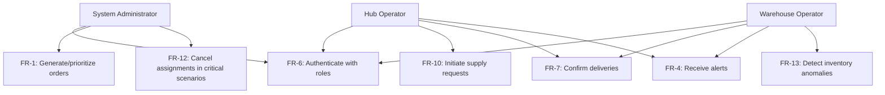
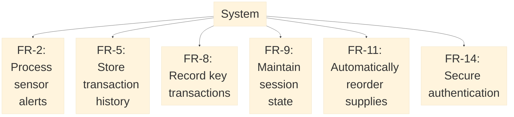

```mermaid
%%{init: {'theme': 'base', 'themeVariables': { 
  'background': '#000000',       /* dark background */
  'lineColor': '#ffffff',        /* default line color */
  'defaultLinkColor': '#ffffff', /* edge/link color */
  'primaryBorderColor': '#ffffff', /* node borders */
  'secondaryBorderColor': '#ffffff',
  'fontSize': '48px'
}}}%%
flowchart TD
    A[System Administrator] --> FR6[FR-6: Authenticate with roles]
    A --> FR1[FR-1: Generate/prioritize orders]
    A --> FR12[FR-12: Cancel assignments in critical scenarios]
    
    O[Hub Operator] --> FR6
    O --> FR10[FR-10: Initiate supply requests]
    O --> FR7[FR-7: Confirm deliveries]
    O --> FR4[FR-4: Receive alerts]
    
    W[Warehouse Operator] --> FR6
    W --> FR7
    W --> FR4
    W --> FR13[FR-13: Detect inventory anomalies]

    
```

```mermaid
%%{init: {'theme': 'base', 'themeVariables': { 'background': '#ffffff', 'lineColor': '#333333', 'fontSize': '48px' }}}%%
flowchart TD
    S[System] --> FR2[FR-2: Process sensor alerts]
    S --> FR5[FR-5: Store transaction history]
    S --> FR8[FR-8: Record key transactions]
    S --> FR9[FR-9: Maintain session state]
    S --> FR11[FR-11: Automatically reorder supplies]
    S --> FR14[FR-14: Secure authentication]
    
    

```
